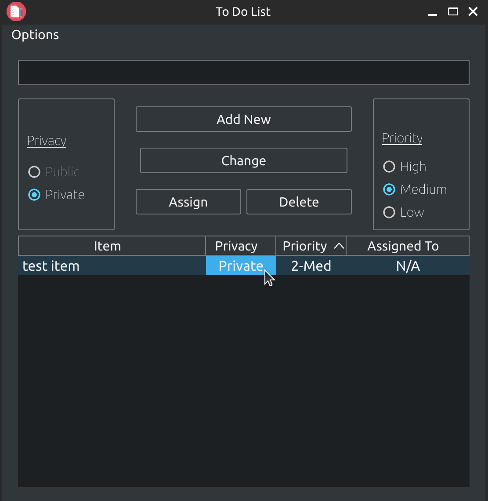
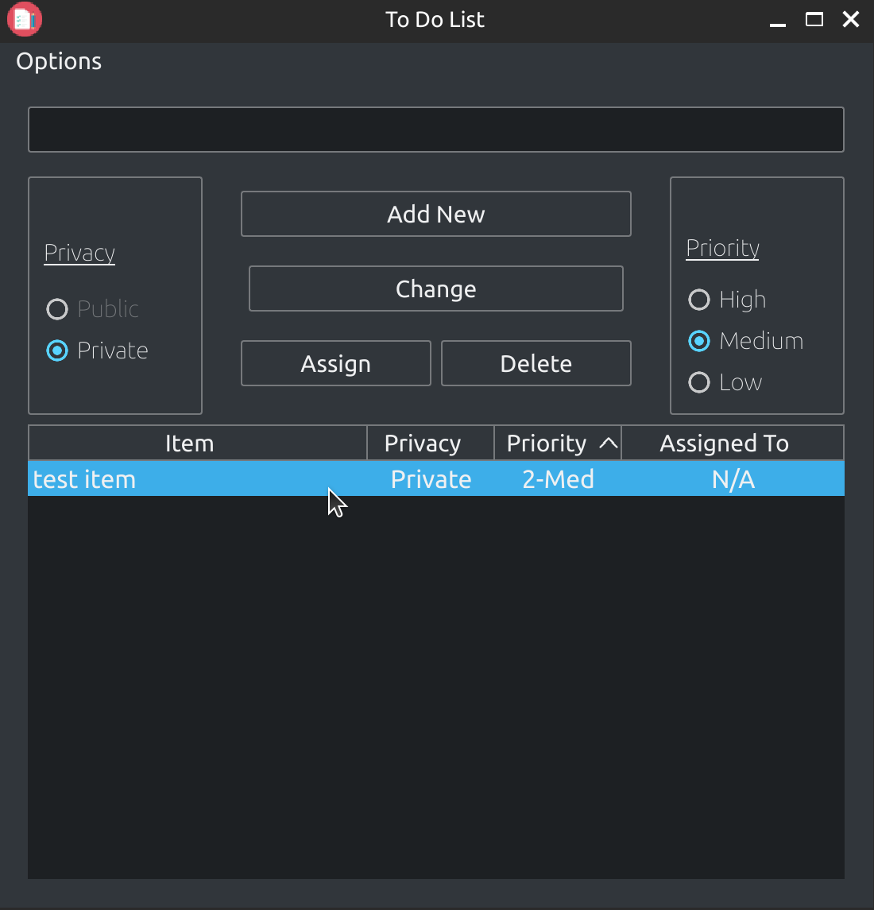
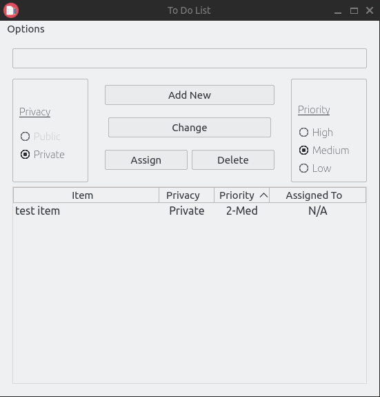
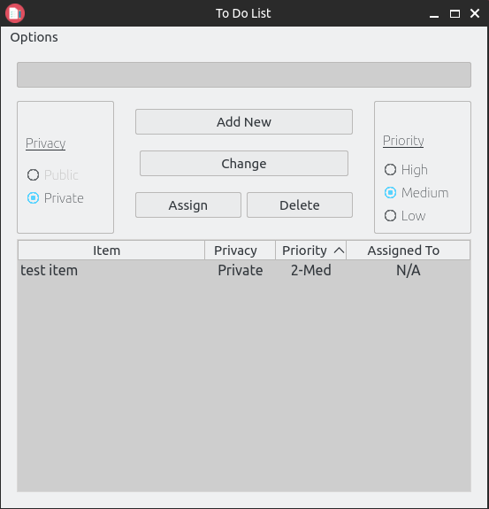

# BreezeStyleSheets

Configurable Breeze and BreezeDark-like stylesheets for Qt Applications.

BreezeStyleSheets is a set of beautiful light and dark stylesheets that render consistently across platforms, including high DPI screens. Each stylesheet is generated from a theme file and can be extended with a extension system, simplifying the generation custom stylesheets for your application. The stylesheets are comprehensively tested with most Qt widgets and widget properties, providing a consistent, stylish feel on any platform, including different operating systems, desktop environments, and Qt versions.

**Table of Contents**

1. [Gallery](#gallery)
2. [Getting Started](#getting-started)
    - [Building Styles](#building-styles)
    - [Python Installation](#python-installation)
    - [CMake Installation](#cmake-installation)
    - [QMake Installation](#qmake-installation)
3. [Examples](#examples)
4. [Features](#features)
    - [Extensions](#extensions)
5. [Customization](#customization)
6. [Extending Stylesheets](#extending-stylesheets)
7. [Debugging](#debugging)
8. [Development Guide](#development-guide)
    - [Git Hooks](#git-hooks)
    - [Configuring Styles](#configuring-styles)
    - [Testing](#testing)
    - [Linting and Type Checks](#linting-and-type-checks)
    - [Distribution Files](#distribution-files)
    - [Git Ignore](#git-ignore)
9. [Known Issues and Workarounds](#known-issues-and-workarounds)
10. [License](#license)
11. [Contributing](#contributing)
12. [Acknowledgements](#acknowledgements)
13. [Contact](#contact)

## Gallery

### Breeze/BreezeDark

Example user interface using the Breeze and BreezeDark stylesheets side-by-side.

<table cellspacing="0" cellpadding="0">
  <tbody>
    <tr>
      <td></td>
      <td></td>
    </tr>
  </tbody>
</table>

### Alternative themes

Change QTableWidget hover behavior to highlight whole row, instead of individual cells.
Also changes background color of light themes to a light gray and applies theme color to radio buttons and checkboxes.

<table cellspacing="0" cellpadding="0">
  <tbody>
    <tr>
      <td></td>
      <td></td>
    </tr>
  </tbody>
</table>

<table cellspacing="0" cellpadding="0">
  <tbody>
    <tr>
      <td></td>
      <td></td>
    </tr>
  </tbody>
</table>

For an extensive view of screenshots of the theme, see the [gallery](assets/gallery.md).

## Getting Started

Here are detailed instructions on how to install Breeze Style Sheets for a variety of build systems and programming languages. This will require a Qt installation with QtCore, QtGui, QtWidgets, and QtSvg installed.

### Building Styles

By default, BreezeStyleSheets comes with the `dark` and `light` themes pre-built in the [resources](/resources/) directory. In order to build all pre-packaged themes including PyQt5 and PyQt6 support, run:

```bash
# choose only the frameworks you want
frameworks=("pyqt5" "pyqt6" "pyside2" "pyside6")
for framework in "${frameworks[@]}"; do
    python configure.py --styles=all --extensions=all --qt-framework "${framework}" \
        --resource breeze.qrc --compiled-resource "breeze_${framework}.py"
done
```

All generated themes will be in the [dist](/dist) subdirectory, and the compiled Python resource(s) will be in `resources/breeze_{framework}.py` (for example, `resources/breeze_pyqt5.py`). Note that using the `--compiled-resource` flag requires the correct RCC to be installed for the Qt framework (see [Python Installation](#python-installation) for the required RCC).

### Python Installation

To compile the stylesheet for use with PyQt5, PyQt6, PySide2 or PySide6, ensure you configure with the `--compiled-resource` flag (which requires the rcc executable for your chosen framework to be installed - see below for details). The compiled resource Python file now contains all the stylesheet data. To load and set the stylesheet in a PyQt5/6 or PySide2/6 application, import that file, load the contents using QFile and read the data. For example, to load BreezeDark, first configure using:

```bash
python configure.py --compiled-resource breeze_resources.py
```

Then load the stylesheet and run the application using:

```python
from PyQt5 import QtWidgets
from PyQt5.QtCore import QFile, QTextStream
# This must match the name of the file and be in the Python search path.
# To modify the search path, add the directory containing the file to `sys.path`.
import breeze_resources


def main():
    app = QtWidgets.QApplication(sys.argv)

    # set stylesheet
    file = QFile(":/dark/stylesheet.qss")
    file.open(QFile.ReadOnly | QFile.Text)
    stream = QTextStream(file)
    app.setStyleSheet(stream.readAll())

    # code goes here

    app.exec_()
```

The required Qt resource compilers (RCC) for each framework are:
- PyQt5: `pyrcc5`
- PyQt6: `pyside6-rcc` (requires `PySide6` installed)
- PySide2: `pyside2-rcc` (requires Python.10 or earlier)
- PySide6: `pyside6-rcc`

You can also use the pre-compiled resources in the [resources](/resources/) directory.

### CMake Installation

Using CMake, you can download, configure, and compile the resources as part part of the build process. The following configurations are provided by @ruilvo. You can see a full example in [example](/example/cmake/). First, save the following as `breeze.cmake`.

```cmake
# Setup Qt: this works with both Qt5 and Qt6
# NOTE: We use cached strings to specify the options for these.
set(CMAKE_AUTOMOC ON)
set(CMAKE_AUTORCC ON)
set(CMAKE_AUTOUIC ON)

find_package(
  ${QT_VERSION}
  COMPONENTS Core Gui Widgets
  REQUIRED)
# -------------------

# Get Python to compile the stylesheets.
# Fetch the repository, configure, compile the stylesheets.
find_package(Python COMPONENTS Interpreter)

include(FetchContent)

set(FETCHCONTENT_QUIET OFF CACHE BOOL "Silence fetch content" FORCE)

FetchContent_Declare(
  breeze_stylesheets
  GIT_REPOSITORY https://github.com/Alexhuszagh/BreezeStyleSheets.git
  GIT_TAG origin/main
  GIT_PROGRESS ON
  GIT_SHALLOW 1
  USES_TERMINAL_DOWNLOAD TRUE)

FetchContent_GetProperties(breeze_stylesheets)
if(NOT breeze_stylesheets_POPULATED)
  FetchContent_Populate(breeze_stylesheets)

  add_library(breeze STATIC "${breeze_stylesheets_SOURCE_DIR}/dist/breeze.qrc")

  add_custom_target(
    run_python_breeze ALL
    COMMAND ${Python_EXECUTABLE} configure.py --extensions=${BREEZE_EXTENSIONS}
            --styles=${BREEZE_STYLES} --resource breeze.qrc
    WORKING_DIRECTORY ${breeze_stylesheets_SOURCE_DIR}
    BYPRODUCTS "${breeze_stylesheets_SOURCE_DIR}/dist/breeze.qrc"
    COMMENT "Generating themes")

  add_dependencies(breeze run_python_breeze)
endif()
```

Next, make sure the path to `breeze.cmake` is in your module search [path](https://cgold.readthedocs.io/en/latest/tutorials/cmake-sources/includes.html), and add the following to your CMakeLists.txt:

```cmake
set(QT_VERSION Qt5 CACHE STRING "The Qt version framework to use (Qt5 or Qt6).")
set(BREEZE_EXTENSIONS all CACHE STRING "The extensions to include in our stylesheets.")
set(BREEZE_STYLES all CACHE STRING "The styles to include in our stylesheets.")

include(breeze)

add_executable(myapp WIN32 MACOSX_BUNDLE "main.cpp")
target_link_libraries(myapp PRIVATE Qt${QT_VERSION_MAJOR}::Widgets breeze)
```

And then in your application start point, add the following:

```cpp
#include <QApplication>
#include <QFile>
#include <QTextStream>

int main(int argc, char *argv[])
{
    QApplication app(argc, argv);

    // Need to initialize the resource, since we're using an external
    // build system and this isn't automatically handled by CMake.
    Q_INIT_RESOURCE(breeze);
    QFile file(":/dark/stylesheet.qss");
    file.open(QFile::ReadOnly | QFile::Text);
    QTextStream stream(&file);
    app.setStyleSheet(stream.readAll());

    // code goes here

    return app.exec();
}
```

### QMake Installation

Copy the contents of the `dist` subdirectory into your project directory and add the qrc file to your project file.

For example:

```qmake
TARGET = app
SOURCES = main.cpp
RESOURCES = breeze.qrc
```

To load the stylesheet in C++, load the file using QFile and read the data. For example, to load BreezeDark, run:

```cpp
#include <QApplication>
#include <QFile>
#include <QTextStream>


int main(int argc, char *argv[])
{
    QApplication app(argc, argv);

    // set stylesheet
    QFile file(":/dark/stylesheet.qss");
    file.open(QFile::ReadOnly | QFile::Text);
    QTextStream stream(&file);
    app.setStyleSheet(stream.readAll());

    // code goes here

    return app.exec();
}
```

## Examples

Many examples of widgets using [custom themes](/example/widgets.py), including with the [Advanced Docking System](/example/advanced-dock.py), [custom icons](/example/standard_icons.py), and [titlebars](/example/titlebar.py) can be found in the [example](/example/) directory.

The support stylesheets include:
- `dark`
- `light`
- `auto`
- `native` (the system native theme)

And any `-purple`, `-green`, etc. variants can also be used. `auto` will automatically detect if the system theme is light or dark and select the correct theme accordingly. A recipe for a cross-platform way to detect the correct theme in Python or C++ is shown in our [System Theme Detection](/example/README.md#system-theme-detection).

## Features

- Complete stylesheet for all Qt widgets, including esoteric widgets like `QCalendarWidget`.
- Customizable, beautiful light and dark themes.
- Cross-platform icon packs for standard icons.
- Extensible stylesheets: add your own extensions or rules and automatically configure them using the same configuration syntax.

### Extensions

The supported extensions can be found in the [extensions](/extension/README.md) directory and include theme support for:
- [Advanced Docking System](/extension/README.md#advanced-docking-system)
- [QDockWidget Tooltips](/extension/README.md#qdockwidget-tooltips)
- [Complete Standard Icon Set](/extension/README.md#standard-icons)

## Customization

It's easy to design your own themes using `configure.py`. First, add the styles you want into [theme](/theme/), then run configure with a list of styles you want to include.

### Theme

Here is a sample theme, with the color descriptions annotated. Please note that although there are nearly 40 possibilities, for most applications, you should use less than 20, and ~10 different hues.

```jsonc
// NOTE: This is a custom JSON file, where lines leading
// with `//` are removed. No other comments are valid.
{
    // Main foreground color.
    "foreground": "#eff0f1",
    // Lighter foreground color for selected items.
    "foreground-light": "#ffffff",
    // Main background color.
    "background": "#31363b",
    // Alternate background color for styles.
    "background:alternate": "#31363b",
    // Main color to highlight widgets, such as on hover events.
    "highlight": "#3daee9",
    // Color for selected widgets so hover events can change widget color.
    "highlight:dark": "#2a79a3",
    // Alternate highlight color for hovered widgets in QAbstractItemViews.
    "highlight:alternate": "#369cd1",
    // Main midtone color, such as for borders.
    "midtone": "#76797c",
    // Lighter color for midtones, such as for certain disabled widgets.
    "midtone:light": "#b0b0b0",
    // Darker midtone, such as for the background of QPushButton and QSlider.
    "midtone:dark": "#626568",
    // Lighter midtone for separator hover events.
    "midtone:hover": "#8a8d8f",
    // Color for checked widgets in QAbstractItemViews.
    "view:checked": "#334e5e",
    // Hover background color in QAbstractItemViews.
    // This should be fairly transparent.
    "view:hover": "rgba(61, 173, 232, 0.1)",
    // Background for a horizontal QToolBar.
    "toolbar:horizontal:background": "#31363b",
    // Background for a vertical QToolBar.
    "toolbar:vertical:background": "#31363b",
    // Background color for the corner widget in a QAbstractItemView.
    "view:corner": "#31363b",
    // Border color between items in a QHeaderView.
    "view:header:border": "#76797c",
    // Background color for a QHeaderView.
    "view:header": "#31363b",
    // Border color Between items in a QAbstractItemView.
    "view:border": "#31363b",
    // Background for QAbstractItemViews.
    "view:background": "#1d2023",
    // Background for widgets with text input.
    "text:background": "#1d2023",
    // Background for the currently selected tab.
    "tab:background:selected": "#31363b",
    // Background for non-selected tabs.
    "tab:background": "#2c3034",
    // Color for the branch/arrow icons in a QTreeView.
    "tree": "#afafaf",
    // Color for the chunk of a QProgressBar, the active groove
    // of a QSlider, and the border of a hovered QSlider handle.
    "slider:foreground": "#3daee9",
    // Background color for the handle of a QSlider.
    "slider:handle:background": "#1d2023",
    // Color for a disabled menubar/menu item.
    "menu:disabled": "#76797c",
    // Color for a checked/hovered QCheckBox or QRadioButton.
    "checkbox:light": "#58d3ff",
    // Color for a disabled or unchecked/unhovered QCheckBox or QRadioButton.
    "checkbox:disabled": "#c8c9ca",
    // Color for the handle of a scrollbar. Due to limitations of
    // Qt stylesheets, any handle of a scrollbar must be treated
    // like it's hovered.
    "scrollbar:hover": "#3daee9",
    // Background for a non-hovered scrollbar.
    "scrollbar:background": "#1d2023",
    // Background for a hovered scrollbar.
    "scrollbar:background:hover": "#76797c",
    // Default background for a QPushButton.
    "button:background": "#31363b",
    // Background for a pressed QPushButton.
    "button:background:pressed": "#454a4f",
    // Border for a non-hovered QPushButton.
    "button:border": "#76797c",
    // Background for a disabled QPushButton, or fallthrough
    // for disabled QWidgets.
    "button:disabled": "#454545",
    // Color of a dock/tab close icon when hovered.
    "close:hover": "#b37979",
    // Color of a dock/tab close icon when pressed.
    "close:pressed": "#b33e3e",
    // Default background color for QDockWidget and title.
    "dock:background": "#31363b",
    // Color for the float icon for QDockWidgets.
    "dock:float": "#a2a2a2",
    // Background color for the QMessageBox critical icon.
    "critical": "#80404a",
    // Background color for the QMessageBox information icon.
    "information": "#406880",
    // Background color for the QMessageBox question icon.
    "question": "#634d80",
    // Background color for the QMessageBox warning icon.
    "warning": "#99995C",
    // These are extension-specific
    // The background color for an Advanced Docking System Tab
    "ads-tab:focused": "rgba(61, 173, 232, 0.1)",
    "ads-border:focused": "rgba(61, 173, 232, 0.15)"
}
```

Once you've saved your custom theme, you can then build the stylesheet, icons, and resource file with:

```bash
python configure.py --styles=dark,light,<custom> --resource custom.qrc
```

Then, you can use `custom.qrc`, along with the generated icons and stylesheets in each folder, in place of `breeze.qrc` for any style.

The `--styles` command flag takes a comma-separated list of values, or `all`, which will configure every theme present in the [themes](/theme) directory.

#### Generating Colors

As a reference point, see the pre-generated [themes](/theme). In general, to create a good theme, modify only the highlight colors (blues, greens, purples) to a new color, such that the saturation and lightness stay the same (only the hue changes). For example, the color `rgba(51, 164, 223, 0.5)` becomes `rgba(164, 51, 223, 0.5)`.

#### Adding Extensions

We also allow customizable extensions to extend the default stylesheets with additional style rules, using the colors defined in your theme. This also enables the integration of third-party Qt extensions/widgets into the generated stylesheets.

For example, to configure with extensions for the [Advanced Docking System](https://github.com/githubuser0xFFFF/Qt-Advanced-Docking-System), run:

```bash
python configure.py --extensions=advanced-docking-system --resource custom.qrc
```

Like with styles, `--extensions` takes a comma-separated list of values, or `all`, which will add every extension present in the [extensions](/extension) directory. For a detailed introduction to creating your own extensions, see the extensions [tutorial](/extension/README.md).

## Extending Stylesheets

There are some limitations of using Qt stylesheets in general, which cannot be solved by stylesheets. To get more fine-grained style control, you should subclass `QCommonStyle`:

```c++
class ApplicationStyle: public QCommonStyle
{
    ...
}
```

The limitations of stylesheets include:

- Using custom standard icons.
- Scaling icons with the theme size.
- QToolButton cannot control the icon size without also affecting the arrow size.
- Close and dock float icon sizes scale poorly with font size.

For an example of using QCommonStyle to override standard icons in a PyQt application, see [standard_icons.py](/example/standard_icons.py). An extensive reference can be found [here](https://doc.qt.io/qt-6/style-reference.html). A reference of QStyle, and the default styles Qt provides can be found [here](https://doc.qt.io/qt-6/qstyle.html).

## Debugging

Have an issue with the styles? Here's a few suggestions, prior to filing a bug report:
- Modified the application font? Make sure you do **before** setting the application stylesheet.
- Modified the application style? Make sure you do **after** you creating a `QApplication instance` but **before** you show the window or add widgets.

## Development Guide

### Git Hooks

Contributors to BreezeStylesheets should make use of [vcs](/vcs.py) and [scripts](/scripts/) to both install Git hooks and run local tests and typechecking. After cloning the repository, developers should first install a pre-commit hook, to ensure their code is formatted and linted prior to commiting:

```bash
python vcs.py --install-hooks
```

### Configuring Styles

To configure the assets and the stylesheets, run `python configure.py`. To compile the assets and stylesheets for PyQt5, ensure `pyrcc5` is installed (for other frameworks, see [Python Installation](#python-installation) for the correct RCC) and run:

```bash
python configure.py --compiled-resource breeze_resources.py
```

### Testing

The unittest suite is [ui.py](test/ui.py). By default, the suite runs every test, so to test changes to a specific widget, pass the `--widget $widget` flag. To test other configurations, see the options for `--stylesheet`, `--widget`, `--font-size`, and `--font-family`, and then run the tests with the complete UI in [widgets.py](/example/widgets.py). If the widget you fixed the style for does not exist in the test suite or [widgets.py](/example/widgets.py), please add it.

```bash
# Test all widgets
$ python test/ui.py --stylesheet $theme
# Test only a single widget.
$ python test/ui.py --widget $widget --stylesheet $theme
# Get the help options.
$ python test/ui.py --help
usage: ui.py [-h] [--stylesheet STYLESHEET] [--style STYLE] [--font-size FONT_SIZE] [--font-family FONT_FAMILY]
             [--scale SCALE] [--qt-framework {pyqt5,pyqt6,pyside2,pyside6}] [--use-x11] [--widget WIDGET]
             [--width WIDTH] [--height HEIGHT] [--alignment ALIGNMENT] [--compress] [--print-tests] [--start START]

Configurations for the Qt5 application.

options:
  -h, --help            show this help message and exit
  --stylesheet STYLESHEET
                        stylesheet name (`dark`, `light`, `native`, ...)
  --style STYLE         application style (`Fusion`, `Windows`, `native`, ...)
  --font-size FONT_SIZE
                        font size for the application
  --font-family FONT_FAMILY
                        the font family
  --scale SCALE         scale factor for the UI
  --qt-framework {pyqt5,pyqt6,pyside2,pyside6}
                        target framework to build for. Default = pyqt5. Note: building for PyQt6 requires PySide6-rcc
                        to be installed.
  --use-x11             force the use of x11 on compatible systems.
  --widget WIDGET       widget to test. can provide `all` to test all widgets
  --width WIDTH         the window width
  --height HEIGHT       the window height
  --alignment ALIGNMENT
                        the layout alignment
  --compress            add stretch on both sides
  --print-tests         print all available tests (widget names).
  --start START         test widget to start at.
# Get a complete list of available tests.
$ python test/ui.py --print-tests
aero_wizard
all_focus_tree
alpha_colordialog
...
wizard
yes_button
```

To see the complete list of Qt widgets covered by the unittests, see [Test Coverage](Test%20Coverage.md).

### Linting and Type Checks

You can check code quality using static typecheckers and code linters.

```bash
# format python code to a standard style.
# requires `black` and `isort` to be installed.
scripts/fmt.sh
# run linters and static typecheckers
# requires `pylint`, `pyright`, and `flake8` to be installed
scripts/lint.sh
# check if the system can automatically determine the theme
# on windows, this requires `winrt-Windows.UI.ViewManagement`
# and `winrt-Windows.UI` to be installed.
scripts/theme.sh
# run more involved, comprehensive tests. these assume a Linux
# environment and detail the install scripts to use them.
scripts/cmake.sh
scripts/headless.sh
```

### Distribution Files

When pushing changes, only the `light` and `dark` themes should be configured, without any extensions. To reset the built resource files to the defaults (this requires the correct RCC to be installed), run:

```bash
python configure.py --clean \
    --compiled-resource breeze_resources.py
```

If no changes are being made to the icons or stylesheets, you may want to ensure that the `dist` directory is assumed to be unchanged in git, no longer tracking changes to these files. You can turn tracking distribution files off with:

```bash
python vcs.py --no-track-dist
```

To turn back on tracking, run:

```bash
python vcs.py --track-dist
```

### Git Ignore

Note that the `.gitignore` is auto-generated via `vcs.py`, and the scripts to track or untrack distribution files turn off `.gitignore` tracking. Any changes should be made in `vcs.py`, and ensure that `.gitignore` is tracked, and commit any changes:

```bash
python vcs.py --track-gitignore
git add .gitignore
git commit -m "..."
```

## Known Issues and Workarounds

For known issues and workarounds, see [issues](/ISSUES.md).

## License

MIT, see [license](/LICENSE.md).

## Contributing

Unless you explicitly state otherwise, any contribution intentionally submitted for inclusion in BreezeStyleSheets by you shall be licensed under the MIT license without any additional terms or conditions. See the [changelog](/CHANGELOG.md) for changes and contributors to the project.

## Acknowledgements

BreezeStyleSheets is a fork of [QDarkStyleSheet](https://github.com/ColinDuquesnoy/QDarkStyleSheet). Some of the icons are modified from [Material UI](https://github.com/google/material-design-icons) and [Material Design Icons](https://materialdesignicons.com/) (both of which use an Apache 2.0 [license](/MaterialUi.LICENSE)), and are redistributed under the MIT license.

Major contributions to the project have been made by:
- [Inverted-E](https://github.com/Inverted-E/)

## Contact

Email: [ahuszagh@gmail.com](mailto:ahuszagh@gmail.com)
Twitter: KardOnIce
