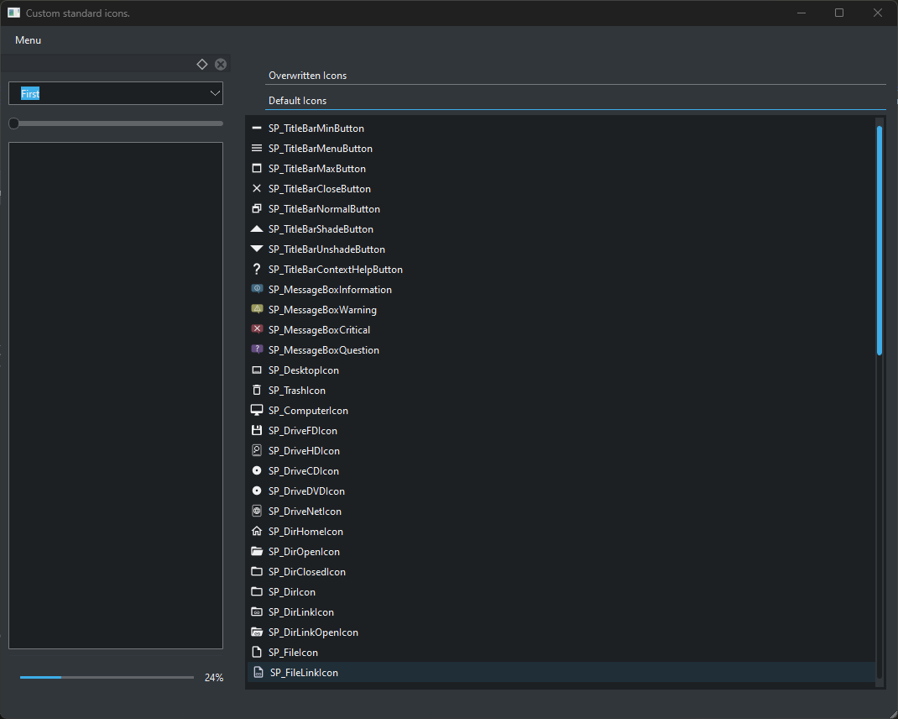
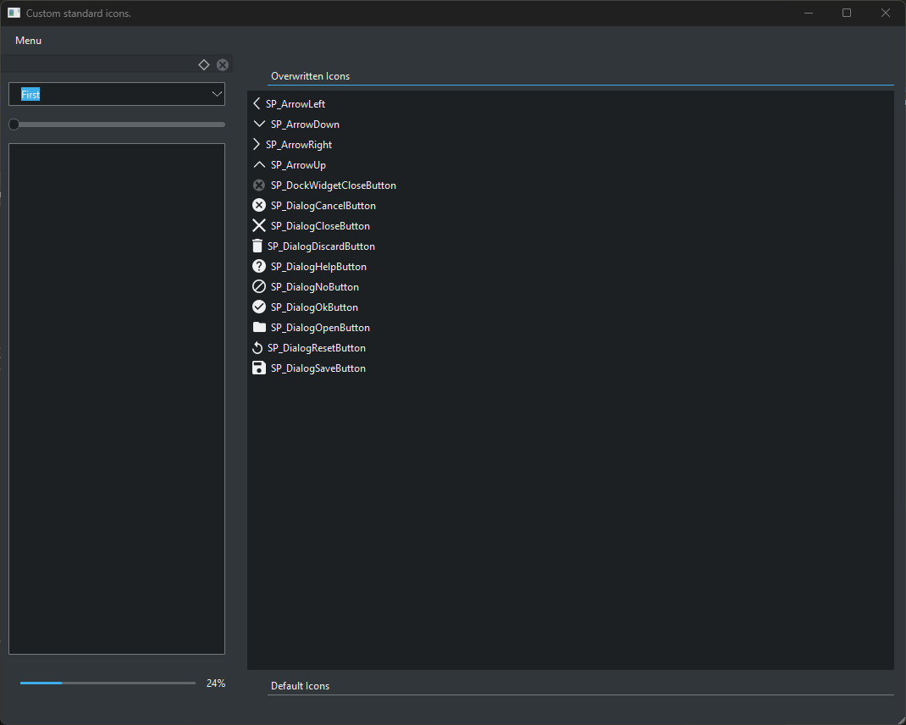
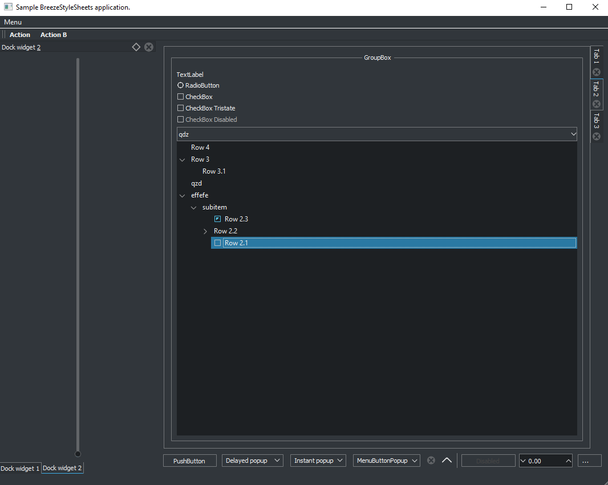
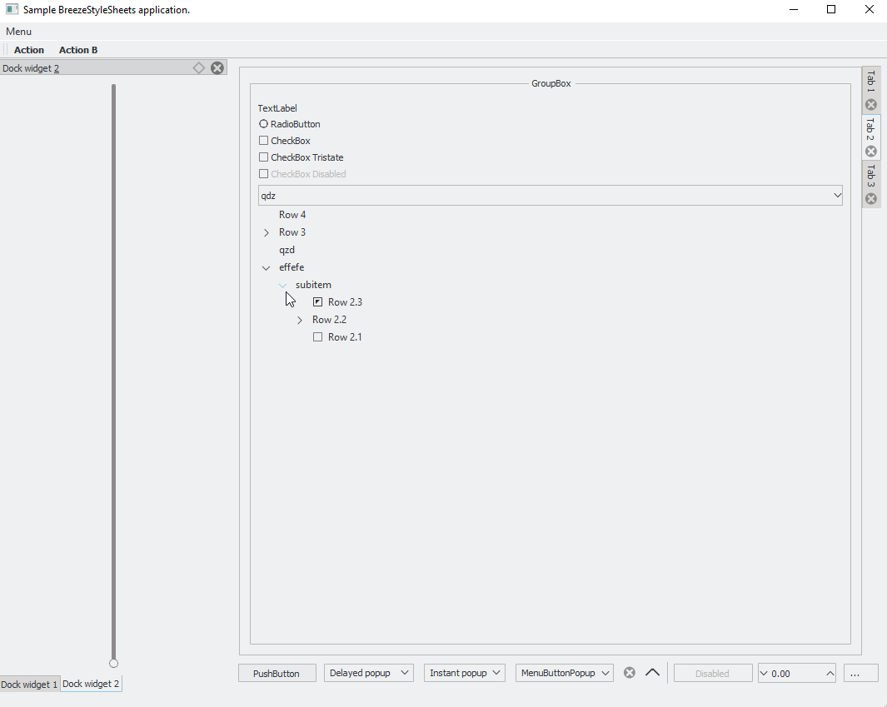

# Examples

Here are numerous examples, including recipes, including auto-detecting the system theme, support for the Advanced Docking System, and overriding standard icons. Most of the widgets are drop-in replacements, with modifying `compat` in [shared.py](/example/shared.py) with the correct Qt imports and any other helper functions.

**Table of Contents**

1. [Advanced Docking System](#advanced-docking-system)
2. [System Theme Detection](#system-theme-detection)
3. [System Icons](#system-icons)
4. [Custom Titlebars](#custom-titlebars)
5. [Dial Widgets](#dial-widgets)
6. [Branchless QTreeView](#branchless-qtreeview)
7. [LCD](#lcd)
8. [Slider](#slider)
9. [Non-Stylesheet Styling](#non-stylesheet-styling)
10. [CMake](#cmake)
11. [Example Widgets](#example-widgets)

## Advanced Docking System

Shows use of the [Advanced Docking System](https://github.com/githubuser0xFFFF/Qt-Advanced-Docking-System) in [Python](/example/advanced-dock.py). This requires `PySide6-QtAds` (for PySide6) or `PyQtAds` (for PyQt5) (`PyQt6` and `PySide2` are not supported). This requires configuring with the `advanced-docking-system` extension.


## System Theme Detection

To provide a consistent application style matching the system theme, you can detect it via using Qt for versions 6.5+, or using the [system theme](/example/detect/) Python and C++ utilities. Both are stand-alone libraries that can be dropped in any project. A cross-platform, version-agnostic approach to detect if light or dark mode is:

```python
import system_theme


def get_theme() -> system_theme.Theme:
    '''Detect the system theme.'''

    if QT_VERSION >= (6, 5, 0):
        color_scheme = app.styleHints().colorScheme()
        if color_schema == ColorScheme.Unknown:
            return system_theme.UNKNOWN
        elif color_schema == ColorScheme.Light:
            return system_theme.LIGHT
        return system_theme.DARK
    return system_theme.get_theme()
```

## System Icons

To provide consistent themes, you can override the default system icons. An [example](/example/icons/standard.py) comparing the icons between Windows and our overrides is below.  This requires configuring with the `standard-icons` extension.

<table cellspacing="0" cellpadding="0">
  <thead>
    <tr>
      <th><center>Default Icons</center></th>
      <th><center>Custom Icons</center></th>
    </tr>
  </thead>
  <tbody>
    <tr>
      <td></td>
      <td></td>
    </tr>
  </tbody>
</table>

Then, create a style factory and register the style with your style:

```python
# where the style name is a Qt style, like Windows or Fusion,
style = QtWidgets.QStyleFactory.create('Windows')
style = StandardIconStyle(style)
app.setStyle(style)
```

## Custom Titlebars

When the stylesheet color does not match the system theme, the titlebar can look out of place with the application.


Removing the application titlebar and using a custom [titlebar](/example/titlebar/titlebar.py) can create a consistent look anbd feel.

First, ensure the main window (and any subwindows) remove the titlebar, optionally removing hints:

```python
# this removes the title bar, and optionally the help and shade button hints
flags = titlebar.QtCore.Qt.WindowType(0)
flags |= titlebar.compat.WindowContextHelpButtonHint
flags |= titlebar.compat.WindowShadeButtonHint
```

Next, initialize the application, load your stylesheet, and install an event filter for the window to track move, drag, and other events:

```python
app = QtWidgets.QApplication.instance()
app.installEventFilter(window)
```

This custom titlebar supports the following:
- Title text
- Title bar with menu, help, min, max, restore, close, shade, and unshade.
  - Help, shade, and unshade are optional.
  - Menu contains restore, min, max, move, resize, stay on top, and close.
- Custom window minimization.
  - Minimized windows can be placed in any corner.
  - Windows reposition on resize events to avoid truncating windows.
- Dynamically toggle window state to keep windows above others.
- Drag titlebar to move window
- Double click titlebar to change window state.
  - Restores if maximized or minimized.
  - Shades or unshades if in normal state and applicable.
  - Otherwise, maximizes window.
- Context menu move and resize events.
  - Click "Size" to resize from the bottom right based on cursor.
  - Click "Move" to move bottom-center of titlebar to cursor.
- Drag to resize on window border with or without size grips.
  - If the window contains size grips, use the default behavior.
  - Otherwise, monitor mouse and hover events on window border.
    - If hovering over window border, draw appropriate resize cursor.
    - If clicked on window border, enter resize mode.
    - Click again to exit resize mode.
- Custom border width for a window outline.

The following Qt properties ensure proper styling of the UI:
- `isTitlebar`: should be set on the title bar. ensures all widgets in the title bar have the correct background.
- `isWindow`: set on the window to ensure there is no default border.
- `hasWindowFrame`: set on a window with a border to draw the frame.


The custom titlebar mas **MAJOR** limitations and if possible, it's better to change the look and feel using your OS's API.

- **Linux - Wayland**
  - Cannot move the window position. This cannot be done even if you know the compositor (such as kwin).
  - Cannot use the menu resize due to `QWidget::mouseGrab()`.
    - This plugin supports grabbing the mouse only for popup windows
    - The window stops tracking mouse movements past a certain distance.
  - Attempting to move the window position causes global position to be wrong.
  - Wayland does not support `Stay on Top` directive.
    - qt.qpa.wayland: Wayland does not support QWindow::requestActivate()
  - The menu resize has to guess the mouse position outside of the window bounds.
    - This cannot be fixed since we cannot use mouse events if the user is outside the main window, nor do hover events trigger. We cannot guess where the user left the main window, since `QCursor::pos` will not be updated until the user moves the mouse within the application, so merely resizing until the actual cursor is within the window won't work.
    - We cannot intercept mouse events for the menu resize outside the window (this even occurs when forcing X11 on Wayland).
- **Windows**
  - Cannot resize the menu.
  - Subwindows and windows cannot track outside the main window boundaries.

**Customizing Windows Title Bars via the Win32 API:**

On Windows, you can use the [Desktop Window Manager](https://learn.microsoft.com/en-us/windows/win32/api/_dwm/) Win32 API on Windows 10+.

First, get the HDNL for the [window](https://doc.qt.io/qt-6/qwidget.html#winId).

```cpp
auto window_handle = reinterpret_cast<HWND*>(window.winId());
```

To toggle dark mode on or off, use:

```cpp
#include <dwmapi.h>
#include <windows.h>

// set to true or false
auto use_dark_mode = true;
auto success = SUCCEEDED(DwmSetWindowAttribute(
    window_handle,
    DWMWINDOWATTRIBUTE::DWMWA_USE_IMMERSIVE_DARK_MODE,
    &use_dark_mode,
    sizeof(use_dark_mode)));
```

You can set specific [colors](https://learn.microsoft.com/en-us/windows/win32/api/dwmapi/ne-dwmapi-dwmwindowattribute) as well to mimic the stylesheet theme, such as the border and caption colors, and then redraw the window to set the colors. Colors are provided in the `0x00BBGGRR` format. The supported colors are:

- Border: `DWMWA_BORDER_COLOR`
- Caption: `DWMWA_CAPTION_COLOR`
- Text: `DWMWA_TEXT_COLOR`

```cpp
#include <dwmapi.h>
#include <windows.h>

COLORREF color = 0x00505050;
auto success = SUCCEEDED(DwmSetWindowAttribute(
    window_handle,
    DWMWINDOWATTRIBUTE::DWMWA_BORDER_COLOR,
    &color,
    sizeof(color)));

// you must redraw the window to change the titlebar colors
ShowWindow(window_handle, SW_MINIMIZE);
ShowWindow(window_handle, SW_RESTORE);
```

## Dial Widgets

The standard [QDial] widget cannot be stylized via stylesheets and is quite aesthetically unappealing. However, subclassing the paint events in `QDial` can apply the stylesheet colors to restyle the [dial](/example/dial/dial.py).


## Branchless QTreeView

This is an example widget for a `QTreeView` where the branch indicators are hidden. In order to add these branchless indicators to your project, copy the branchless [directory](/example/branchless/) into the [extension](/extension) folder, and then configure with (adding any additional resources or styles as you see fit):

```bash
# choose the desired framework from pyqt5, pyqt6, pyside2, pyside6
framework=pyqt5
python configure.py \
  --styles=all \
  --extensions=all \
  --qt-framework \
  "${framework}" \
  --resource breeze.qrc \
  --compiled-resource \
  "breeze_${framework}.py"
```

Then, to remove the branch indicators, you must also set the object name for each `QTreeView` or `QTreeWidget` to `"branchless"`, for example, in Python, `tree.setObjectName("branchless")`.

<table cellspacing="0" cellpadding="0">
  <thead>
    <tr>
      <th><center>Dark</center></th>
      <th><center>Light</center></th>
    </tr>
  </thead>
  <tbody>
    <tr>
      <td>
        
      </td>
      <td>
        
      </td>
    </tr>
  </tbody>
</table>

## LCD

Similar to [QDial], the standard [QLCDNumber] widget cannot be stylized via stylesheets and is quite aesthetically unappealing. However, subclassing the paint events in `QLCDNumber` can apply the stylesheet colors to restyle the [LCD display](/example/lcd/lcd.py).


## Slider

Similar to [QDial], the standard [QSlider] widget cannot be stylized via stylesheets and is quite aesthetically unappealing. However, subclassing the paint events in `QSlider` can apply the stylesheet colors to restyle the [slider](/example/slider/slider.py).


## Non-Stylesheet Styling

Stylesheets have limitations, as does subclassing individual widgets to override paint events. You can provide more general styling by overriding [QCommonStyle]. See [System Icons](#system-icons) for a simple example implementing a general look and feel of the UI.

First, create a custom subclass of `QCommonStyle`:

```python
class CustomStyle(QtWidgets.QCommonStyle):
    '''A custom application style.'''

    # implementation goes here
```

Then, create a style factory and register the style with your style:

```python
# where the style name is a Qt style, like Windows or Fusion,
style = QtWidgets.QStyleFactory.create('Windows')
style = CustomStyle(style)
app.setStyle(style)
```

## CMake

Using CMake, you can download, configure, and compile the resources as part part of the build process. The following configurations are provided by [ruilvo](https://github.com/ruilvo/). You can see a full example in [example](/example/cmake/). First, use the CMake module [breeze.cmake](/example/cmake/breeze.cmake) and create a [CMakeLists](/example/cmake/CMakeLists.txt).

Add in cached variables necessary to configure the `breeze.cmake` module:

```cmake
set(QT_VERSION Qt5 CACHE STRING "The Qt version framework to use (Qt5 or Qt6).")
set(BREEZE_EXTENSIONS all CACHE STRING "The extensions to include in our stylesheets.")
set(BREEZE_STYLES all CACHE STRING "The styles to include in our stylesheets.")
```

Then, include the module and link the libraries to our executable:

```cmake
include(${CMAKE_CURRENT_SOURCE_DIR}/breeze.cmake)
set(SOURCE_FILES ...)
add_executable(testing ${SOURCE_FILES})
target_link_libraries(executable PRIVATE Qt${QT_VERSION_MAJOR}::Widgets breeze)
```

## Example Widgets

Examples of some simple UIs with our stylesheets include:

[**Widgets**](/example/widgets.py)


[**Placeholder Text**](/example/placeholder_text.py)

This only works on Qt5.


[**What's This**](/example/whatsthis.py)


[**URL**](/example/url.py)


<!-- Links -->
[QDial]: https://doc.qt.io/qt-6/qdial.html
[QLCDNumber]: https://doc.qt.io/qt-6/qlcdnumber.html
[QSlider]: https://doc.qt.io/qt-6/qslider.html
[QCommonStyle]: https://doc.qt.io/qt-6/qcommonstyle.html
